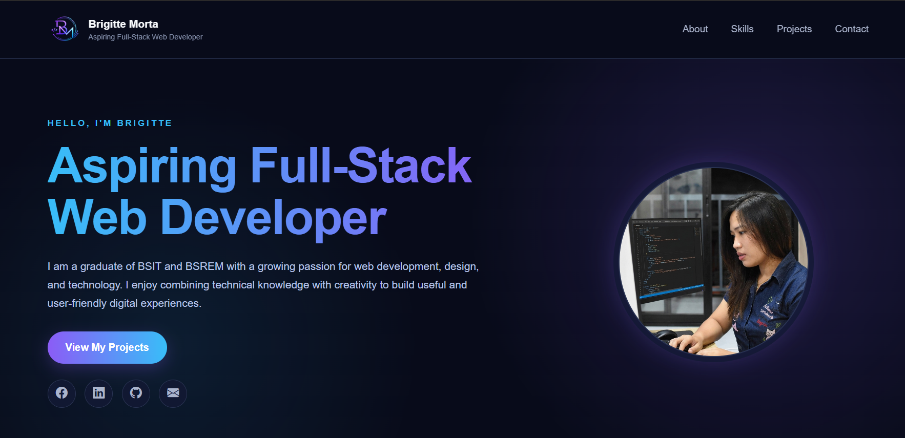

# Personal Portfolio

A responsive personal portfolio website by **Brigitte Morta**, built as part of the MST Connect PH Full-Stack Web Development Bootcamp. The website introduces me as an aspiring full-stack web developer and showcases my skills, projects, contact information, and professional links.

## Live Demo

[View Portfolio](https://bmorta.github.io/capstone1/)

## Screenshot



## Technologies Used

- HTML5
- CSS3
- JavaScript
- Bootstrap 5.3.8
- Bootstrap Icons
- Git
- GitHub
- GitHub Pages

## Main Features

- Responsive Bootstrap navigation with a collapsible mobile menu
- Hero section with my name, developer title, profile photo, and call-to-action button
- About Me section describing my background and learning goals
- Skills section covering programming, design, and administrative skills
- Projects section with responsive project cards
- Technology and skill information
- Contact section with a Bootstrap-styled contact form
- Social media links for Facebook, LinkedIn, GitHub, and Email
- Mobile-first custom CSS media queries
- Responsive profile and project images
- Accessible labels, alternative text, heading structure, and focus states
- GitHub Pages-ready project structure

## Portfolio Sections

### Home / Hero

Introduces **Brigitte Morta** as an aspiring full-stack web developer.

The hero section includes a short introduction, a description of my background, a button for viewing my projects, and links to my professional and social profiles.

### About

Provides an introduction to my educational background and current development goals.

I am a graduate of:

- Bachelor of Science in Information Technology (BSIT)
- Bachelor of Science in Real Estate Management (BSREM)

I am currently continuing my Full-Stack Web Development studies with **MST Connect PH**.

My goal is to combine my technical knowledge, creativity, design skills, and background in real estate and administration to create useful and user-friendly digital experiences.

### Skills

My current skills and areas of development include:

#### Programming

- HTML5
- CSS3
- JavaScript
- Bootstrap
- Git & GitHub
- Responsive Web Development

#### Design

- Web Layout Design
- Responsive Design
- UI Design
- Visual Presentation
- Typography & Spacing
- User-Friendly Interfaces

#### Administrative

- Document Management
- Data Organization
- Record Keeping
- Data Entry
- Task Coordination
- Attention to Detail

### Projects

The current main project is:

**Personal Portfolio**

A responsive personal portfolio website built using semantic HTML, Bootstrap, custom CSS, and responsive design principles.

GitHub Repository:

[View on GitHub](https://github.com/Bmorta/capstone1)

Additional project cards are included as placeholders for future projects.

### Contact

The contact section includes a form with fields for:

- Name
- Email Address
- Message

The current form is for front-end demonstration purposes. It does not send messages until it is connected to a backend or form service.

My email address is:

**brigittemorta@gmail.com**

## Responsive Design

The portfolio follows a mobile-first responsive design approach.

Custom CSS media queries are used at:

- `576px` — large phones
- `768px` — tablets
- `992px` — small laptops
- `1200px` — large desktops

Bootstrap responsive classes are also used to allow sections and components to stack on smaller screens and expand into multiple columns on larger screens.

## Project Structure

```text
capstone1/

├── index.html
├── README.md
├── css/
│   └── style.css
└── images/
    ├── logo.png
    ├── profile.jpg
    └── portfolio-preview.png